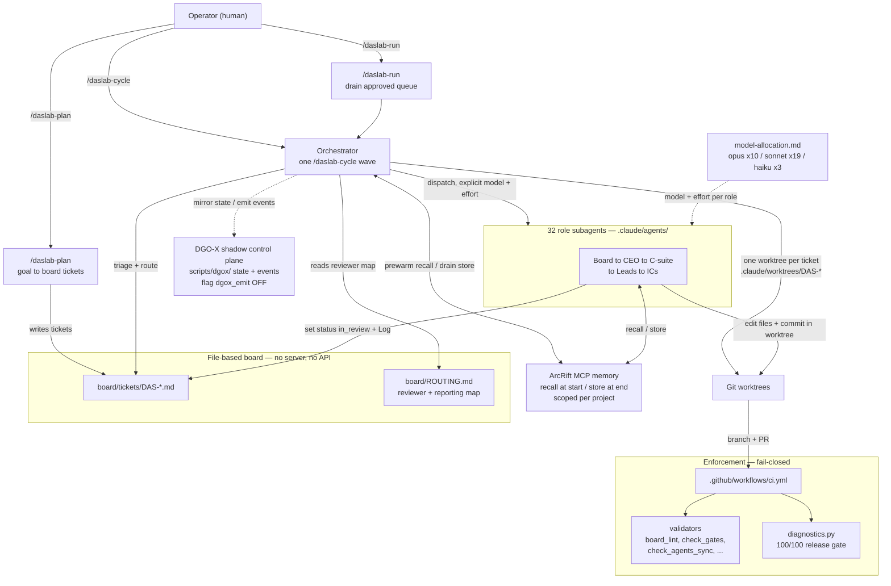
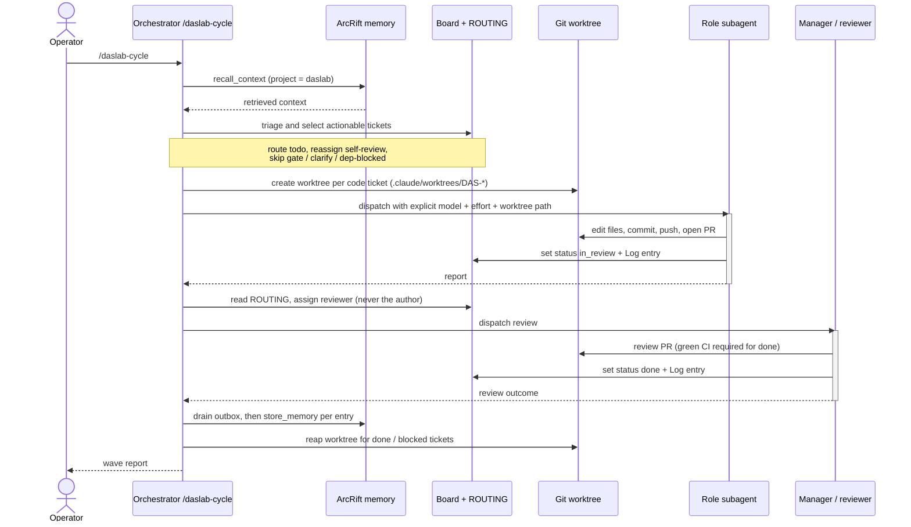

# DasLab — System Architecture

DasLab is an AI-native software company expressed entirely as a repository. There
is no application server, no scheduler, and no control API. The "system" is a
set of Markdown charters, generated subagent shims, a file-based ticket board,
Python validators, and a small library of orchestration skills. A fresh
`git clone` plus a first-run bootstrap is the whole installation; an operator
then drives the organization from a Claude Code session.

This document describes the components, how they fit together, how work flows
through one wave, and why the enforcement model is fail-closed.

## Architectural theses

Four ideas shape every component below.

- **The organization is code.** The company — its board, CEO, C-suite, leads,
  and individual contributors — is checked into the repository as charters and
  generated agent definitions. The org chart, the reviewer map, and the model
  each role runs on are all derived from source-of-truth files by generators,
  never hand-maintained.
- **Files, git, and worktrees instead of a runtime.** State lives in plain files
  in one git repository. Concurrency is handled by git worktrees rather than
  locks or a database. `scripts/check_no_dead_runtime.py` keeps the engine
  server-free by construction.
- **The engine is project-agnostic.** The platform (the "org engine") knows
  nothing about any specific product. Product work lives in `projects/<slug>/`
  (gitignored, each with its own git and its own board); platform work lives in
  the org `board/tickets/`. `scripts/check_project_isolation.py` rejects any
  project name that leaks into engine files.
- **Enforcement as code, fail-closed.** Every binding law has a validator, and
  CI runs them on every change. A weighted release scorer, `scripts/diagnostics.py`,
  must read exactly 100/100 or the build fails. Unmeasured is treated as not
  passing, never as a silent green.

## Component architecture



## Components and responsibilities

### Operator and the orchestration skills

The only actor outside the repository is a human operator running Claude Code at
the repo root. Work advances only when the operator invokes a skill — there is
no timer or background daemon. Three orchestration skills live in
`.claude/skills/`:

- **`/daslab-plan`** decomposes a goal into board tickets: stage-gated epics plus
  PR-sized child tickets with owners assigned per the RACI policy. For a new
  project it first runs the Founder Discovery Gate (at least ten discovery
  questions plus sourced research, captured in
  `projects/<slug>/APPROVED-GOAL-QUEUE.md`) and creates no tickets until the
  Founder explicitly approves the queue. Planning dispatches no work.
- **`/daslab-cycle`** runs exactly one work wave (detailed under "The wave"
  below). It is the heart of the runtime.
- **`/daslab-run`** is the supervisor that drains the Founder-approved goal queue
  across waves: when the board is empty it plans the next approved item, then
  runs `/daslab-cycle` waves until the tickets drain or a real stop condition
  (an external blocker, an open gate, or an empty queue) appears. It is operator-
  invoked, not a background loop.

Additional operator and role skills (`daslab-canary`, `daslab-investigate`,
`daslab-learn`, `daslab-qa`, `daslab-review`, `daslab-security-audit`) live in
the top-level `skills/` directory.

### The file-based board and ROUTING

The board is the system of record for in-flight work. One ticket is one Markdown
file at `board/tickets/DAS-<n>-<slug>.md` with snake_case YAML frontmatter (`id`,
`title`, `status`, `assignee`, `author`, `dept`, `priority`, `parent`, `goal`,
`created`, `updated`) and acceptance criteria. The status enum is a Kanban
pipeline: `backlog → todo → in_progress → blocked → in_review → done`.

The board scope is strict: `board/tickets/` holds **platform (org-engine) work
only** — the engine, generators, validators, skills, agent overlays, policies,
and governance themselves. A project's own tickets live in that project's own
board, `projects/<slug>/board-tickets/`, and carry a `project:` field that binds
them to the project. `scripts/board_lint.py` fails any org-board ticket that
declares a `project:` field, mechanically enforcing the Project Placement Law.

`board/ROUTING.md` is the generated reviewer-and-reporting map: for every role it
records who reviews that role's work and who it reports to. It is produced by the
generator, never hand-edited, and it encodes the no-self-review rule — the
author of a ticket can never be its reviewer.

Concurrency on the board is disciplined rather than locked: only the orchestrator
session mutates routing fields (`assignee`, dispatch order); a role subagent
edits only its own ticket file and the artifacts of its work. Every state change
appends a `## Log` entry — who, what, why — so there are no silent edits.

### The 32 role subagents

DasLab is a real four-level company rendered as subagents:

```
Board (Chairman + Board Member)
  └─ CEO
       └─ C-suite managers — CTO · CPO · CDO · CMO · COO
            └─ Leads
                 └─ Individual Contributors
```

The 32 roles split across six departments: Governance 3 (Chairman, Board Member,
CEO), Engineering 13, Product 4, Design 4, Marketing 4, Operations 4. Of these,
29 are wave-dispatched (the CEO, all five managers, every lead, and every IC).
Only the Chairman and the Board Member are wake-on-approval: they act on
approvals rather than participating in every wave.

Each role exists as a generated shim in `.claude/agents/<role>.md`. The shims are
produced by `scripts/gen_subagents.py` from the org tree and the department and
role overlays — they are never hand-edited, and `scripts/check_agents_sync.py`
fails the build if a shim or `ROUTING.md` drifts from its sources. A role reads
its precedence chain on wake: the company charter, board policy, its department
charter, its role overlay, and the department runtime instructions.

### Model allocation

Each role runs on the Claude model its task complexity needs — the task decides,
not the title. The canonical table is `governance/policies/model-allocation.md`,
which `scripts/gen_subagents.py` parses to write `model:` and `effort:` into every
agent shim. The allocation is opus × 10 (the eight AADL gate owners plus the CTO
and the Security Lead), sonnet × 19 (the execution core), and haiku × 3
(high-frequency, templated work). Aliases (`opus`/`sonnet`/`haiku`) are used so
the fleet auto-tracks the newest model of each tier; `effort` is a separate axis
that sets the per-response token budget (opus roles at `high`, the sonnet core at
`medium`, low-ambiguity coordination at `low`; haiku does not support `effort`).

A hard floor protects judgment-dense work: every gate owner, all ADR
authorship and ratification, and the CTO and Security Lead stay on opus
regardless of effort tuning. An agent never upgrades its own model — work that is
too hard for its tier is escalated up the reporting line per `board/ROUTING.md`.

On dispatch the model and effort are **always passed explicitly**, taken from the
shim's frontmatter, because the frontmatter alone is not trusted at runtime
(subagents can silently inherit the parent model — a known Claude Code issue).
The generator is the single source of truth, and `scripts/check_model_mix.py`
guards the distribution.

### Worktree-per-ticket concurrency

Parallelism is isolated at the filesystem layer. Before spawning any subagent,
the orchestrator creates one git worktree per code-touching ticket at a path that
is a pure function of the ticket id — `.claude/worktrees/<TICKET-ID>/` — on a
fresh branch cut from `origin/main`. Because the path is derived from the id, no
two agents can ever share a worktree, which mechanically enforces "one issue =
one branch = one PR = one worktree." Each subagent does all of its edits,
commits, and pushes inside its own worktree and never touches another's.

Pure-documentation or governance tickets that produce no branch may run in the
main checkout. The orchestrator reaps worktrees when their ticket resolves to
`done` or `blocked`, and a reap pass at the start of each wave cleans up any
zombie worktrees left by a crashed prior run. Tickets sitting in `in_review` keep
their worktree alive so the reviewer can inspect the branch.

### Enforcement gates: diagnostics, validators, CI

Three layers turn the binding laws into mechanical checks.

- **`scripts/diagnostics.py`** is the release-gate scorer: a weighted, all-or-
  nothing scorer over seven dimensions — Documentation 20, Architecture 20,
  Code-quality 15, Consistency 15, Portability 15, Security 10, Git-hygiene 5
  (total 100). Each dimension earns its full weight only if every check in it
  passes, otherwise it scores 0; a missing artifact fails its dimension
  gracefully rather than crashing the scorer. The process exits non-zero unless
  the total is exactly 100/100.
- **The validators** in `scripts/` each enforce one law: `board_lint.py` (ticket
  schema, status enum, routing, no orphans, no self-review, the platform-only
  scope), `check_agents_sync.py` (shims and `ROUTING.md` vs. the overlays and
  model table), `check_gates.py` (AADL gate order), `check_no_hardcoded_paths.py`
  and `check_no_dead_runtime.py` (portability and server-freeness),
  `check_project_isolation.py`, `check_codeowners.py`, `check_quickstart.py`,
  `check_links.py`, plus more for clarifications, dependency graphs, cache-prefix
  stability, never-auto-approve risk categories, and gate promotion.
- **CI** (`.github/workflows/ci.yml`) wires it together: on pull requests and
  pushes to `main` it runs `ruff`, `py_compile`s every tracked Python file, runs
  the `pytest` suites, runs the validator chain, scans for secrets, and finishes
  with `diagnostics.py` as the final gate.

### DGO-X shadow control plane

DGO-X is a deterministic, graph-orchestrated, gate-driven control plane that sits
*on top of* the board — it extends the board model, it does not replace it. Its
Python helpers live in `scripts/dgox/`:

- `state.py` — a typed `graph_state` schema. It is a derived mirror of a ticket's
  runtime state, reconstructable by re-reading the board and replaying the event
  store; the board always wins on divergence. It enforces four write-time
  invariants (no AADL stage skip, no self-routing, severity is up-only and may be
  lowered only by an explicit security or gate review, and flat ArcRift scope).
- `events.py` — an append-only JSONL event store, the audit system-of-record. It
  is never rewritten; a correction is a new compensating event.
- `board_adapter.py` — the board-runtime integration.

DGO-X runs in **shadow mode**: it can mirror state and emit events alongside the
board but changes no dispatch behavior, so `/daslab-cycle` is entirely
unaffected. Shadow emission is feature-flagged in `config/features.yaml`
(`dgox_emit`, off by default) and stays off until a downstream consumer exists,
so the consumerless machinery does not burn tokens every wave.

### ArcRift memory loop

Long-term memory lives in **ArcRift**, a local MCP server wired in `.mcp.json`.
The loop is symmetric: recall at the start of work, store at the end. The
orchestrator issues one `recall_context` prewarm per wave and carries the
returned context into each agent's dynamic prompt tail; at the end of the wave it
drains a durable local outbox (`board/.arcrift-outbox.jsonl`, gitignored) and
issues each `store_memory` from a single drainer to avoid a concurrency race —
no store is ever dropped. Memory is scoped strictly by a flat project key
(`daslab`, or `daslab-<slug>`); mixing one project's facts into another is
forbidden, and `prune_memory` removes stale facts. Graph triple extraction routes
to a local Claude bridge and embeddings use a local Ollama model. ArcRift and
Ollama are **optional for booting** — `scripts/doctor.py` treats them as WARN,
not a required check.

## The dispatch and wave model

A wave is the unit of progress. The operator invokes `/daslab-cycle`; the
orchestrator triages and routes the board, selects every actionable ticket,
creates a worktree per code-touching ticket, dispatches the role subagents in
parallel with an explicit model, collects and verifies results, reaps worktrees,
and reports. WIP is one ticket per role per wave (a role may take several tickets,
each as its own subagent instance in its own worktree). A role with nothing
actionable is simply not dispatched.

Wave size has **no policy cap**: the orchestrator dispatches every actionable
ticket in one parallel batch, and real concurrency is bounded only by the Claude
Code harness, which queues excess subagents. The only remaining dispatch bounds
are correctness and ordering guards: the AADL gate order (a ticket behind an open
predecessor gate is not actionable), dependency and clarify gates (a ticket whose
`depends_on` is unmet, or that carries an unresolved `[NEEDS CLARIFICATION]`
marker, is skipped), and the same-repo-zone guard (two tickets that touch the
same repo area must not run in the same wave, so the loser waits for the next
wave). None of these is a clock or a quota.



## How enforcement is fail-closed

The design defaults to "blocked" rather than "allowed" at every gate.

- **The release scorer is all-or-nothing.** A dimension earns its weight only if
  every check passes, and the process exits non-zero on anything below 100/100.
  There is no partial credit and no "good enough."
- **Unmeasured is not green.** Gate promotion is data-disciplined: a check that
  cannot be measured is treated as skipped, never silently passed, so the absence
  of a signal can never be mistaken for success.
- **The done state is verified, not asserted.** An engineering ticket reaches
  `done` only when its PR's CI checks are confirmed green by querying GitHub
  directly; a subagent's claim of success is never sufficient on its own.
- **Risky changes cannot self-approve.** Tickets in never-auto-approve categories
  (new goal, security-sensitive, schema migration, GATE-5 deployment, governance
  or policy, permission change, secret change) must not carry an auto-approval,
  and CI fails them if they do.
- **Generated artifacts cannot drift.** If the agent shims, `ROUTING.md`, or
  `CODEOWNERS` no longer match their sources, the sync validators fail the build,
  so the generated org can never silently diverge from its definition.
- **Lifecycle order is mandatory.** `/daslab-cycle` never dispatches a ticket
  behind an open predecessor gate, and shipping to production with GATE-5 open is
  forbidden — both enforced rather than advised.

## The operating loop

The steady-state operation of DasLab is a short, human-triggered cycle:

1. **Boot** a fresh clone with `python3 scripts/bootstrap.py` (idempotent first-
   run setup) and verify the environment with `python3 scripts/doctor.py`. The
   Quickstart ordering is itself CI-enforced.
2. **Plan** with `/daslab-plan "<goal>"`. A new project passes the Founder
   Discovery Gate and lands in `projects/<slug>/APPROVED-GOAL-QUEUE.md`; once the
   Founder approves, planning emits stage-gated epics and PR-sized tickets to the
   correct board (platform work to `board/tickets/`, project work to the
   project's own board).
3. **Run waves** with `/daslab-cycle` (one wave) or `/daslab-run` (drain the
   approved queue across waves). Each wave recalls context, triages and routes,
   dispatches subagents in isolated worktrees with explicit models, verifies and
   reaps, stores memory, and reports.
4. **Gate.** Every branch flows through CI — `ruff`, `py_compile`, `pytest`, the
   validator chain, secret scanning, and `diagnostics.py` at 100/100 — before it
   can merge.
5. **Operate and remember.** Maintenance work runs under GATE-6, and ArcRift
   carries the decisions forward so the next session starts from accumulated
   context rather than a blank slate.

The result is an organization that is fully reproducible from the repository,
advances only under explicit human control, parallelizes work without locks, and
refuses to ship anything that has not passed every gate.

## Further reading

- [`../README.md`](../README.md) — the platform overview and single source of truth.
- [`README.md`](README.md) — the operator documentation index.
- [`USAGE.md`](USAGE.md) — the end-to-end operator guide.
- [`adr/README.md`](adr/README.md) — the Architecture Decision Records.
- [`../CONTRIBUTING.md`](../CONTRIBUTING.md) — the contribution and branch/PR rules.
- [`../SECURITY.md`](../SECURITY.md) — the security policy.
